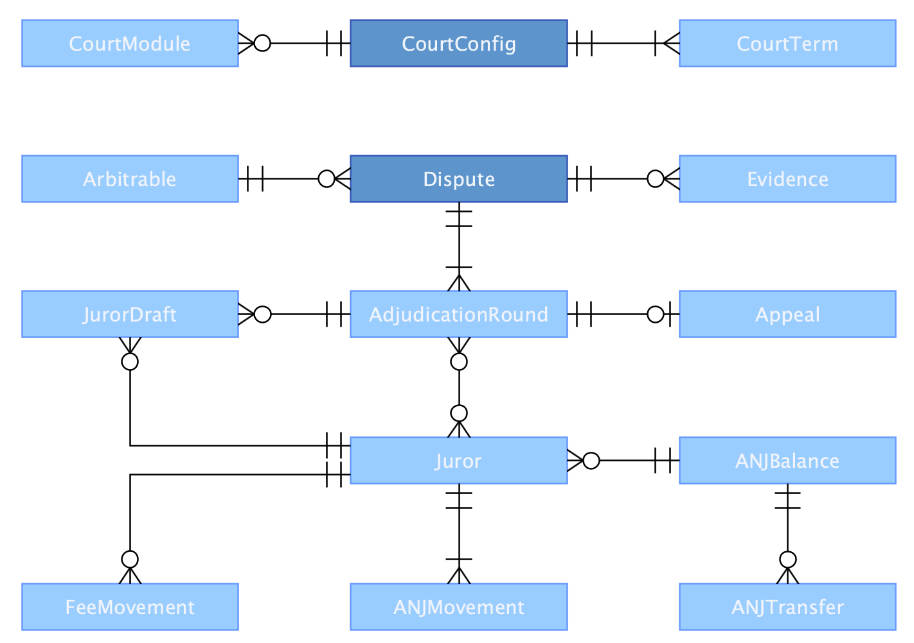

# Aragon Court subgraph

### Model



### Remotes

1. [Mainnet](https://thegraph.com/explorer/subgraph/aragon/aragon-court)
2. [Rinkeby](https://thegraph.com/explorer/subgraph/aragon/aragon-court-rinkeby)
3. [Ropsten](https://thegraph.com/explorer/subgraph/aragon/aragon-court-ropsten)
4. [Staging](https://thegraph.com/explorer/subgraph/aragon/aragon-court-staging)
5. [Usability](https://thegraph.com/explorer/subgraph/aragon/aragon-court-usability)

### Local

To test the subgraph locally please do the following tasks

##### 1. Install Ganache and The Graph and local dependencies
First make sure you have both Ganache and Graph CLIs, and install project dependencies:

```bash
  npm install -g ganache-cli
  npm install -g @graphprotocol/graph-cli
  npm i
```

##### 2. Start Ganache node
Start a local ganache in a separate terminal with the following params:

```bash
  ganache-cli -h 0.0.0.0 -i 15 --gasLimit 8000000 --deterministic
```

##### 3. Start Graph node
In another terminal, clone the graph node and start it:

```bash
  git clone https://github.com/graphprotocol/graph-node/
  cd graph-node/docker
  rm -rf data
  ./setup.sh
  docker-compose up
```

(See [this issue](https://github.com/graphprotocol/graph-node/issues/1132) about the `setup.sh` script)

> If docker prompts you with the error `The reorg threshold 50 is larger than the size of the chain 7, you probably want to set the ETHEREUM_REORG_THRESHOLD environment variable to 0`,
  simply add a new env variable in `docker-compose.yml` named `ETHEREUM_REORG_THRESHOLD` assigning it to 0 and start it again.

##### 4. Deploy local Aragon Court instance
To deploy a local instance run the following commands on a separate terminal:

```bash
  git clone https://github.com/aragon/aragon-network-deploy/
  cd aragon-network-deploy
  npm i
  npm run deploy:court:rpc
```

##### 5. Deploy Aragon Court subgraph
You can use the provided deployment script to create a manifest file, providing the court deployed address as follows:

```bash
  NETWORK=rpc COURT=<COURT_ADDRESS> ./scripts/deploy
```

If you have already deployed it once, there is no need to input the COURT address variable again.
However, note that if you are working with a local chain, this won't recover previous deployed instances unless the process was never stopped.

##### 6. Query Aragon Court subgraph

Open up the following URL to be able to query your graph using the provided GraphiQL console:

http://127.0.0.1:8000/subgraphs/name/aragon/aragon-court-rpc/graphql
